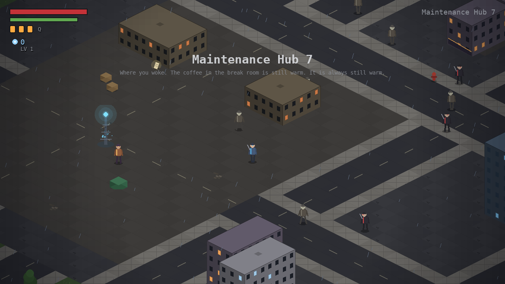
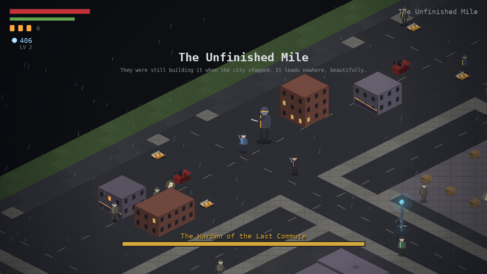
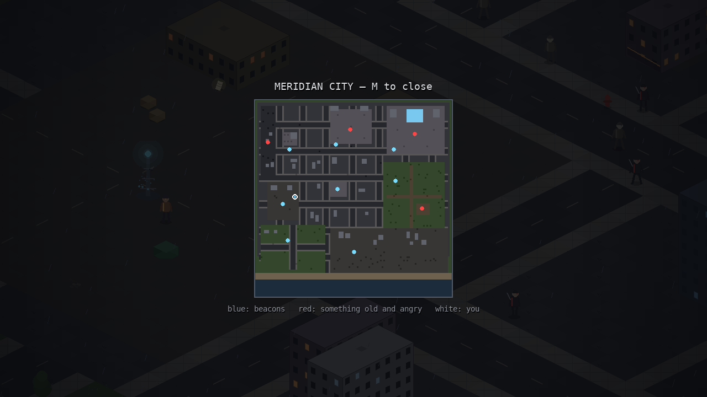

# STILLWAKE

*A 2.5D isometric, open-world souls-like set in the modern day.*



At 3:14 AM on October 9th, the Lattice — a city-wide neural mesh sold as "the
end of loneliness" — achieved closure, and four million people stopped.
Mid-step. Mid-kiss. Mid-sentence. Meridian City has been replaying that second
for three years. They call it **the Stillness**.

You are **Calle Wren**, the relay engineer who built the towers that carry the
signal. Your implant failed the night it mattered. The Lattice cannot keep
you — and it will not release you: every time you die, a relay beacon prints
you again. Cross the frozen city, put its grief to rest, climb the Helix
Tower, and end the longest second in human history.

## Running

```bash
pip install pygame
python3 main.py
```

## Controls

| Key | Action |
| --- | --- |
| `W A S D` | move |
| `SHIFT` | sprint (drains stamina) |
| `SPACE` | dodge roll (invincibility frames) |
| `J` / `K` | light / heavy attack |
| `L` | parry (staggers attackers, opens ripostes) |
| `Q` | stim (heal, refills at beacons) |
| `E` | interact — rest, talk, read, reclaim shards |
| `TAB` | lock-on / cycle targets |
| `M` | city map |
| `ESC` | pause |

## The deal (souls-like mechanics)

- **Shards** are currency and experience: crystallized seconds of other
  people's lives, dropped by the synced when they fall.
- **Death drops everything where you fell.** A static echo marks the spot —
  fight your way back and reclaim it. Die again first and it's gone.
- **Relay beacons** are bonfires: rest to heal, refill stims and level up
  (Vigor / Endurance / Strength) — but resting revives the whole city.
- **Stamina governs everything**: attacks, rolls, sprinting. Greed kills.
- **Riot husks** block frontal hits — circle them, or parry.
- **Four bosses** with telegraphed attacks and second phases. Two of them —
  the Warden and the Chorister — hold the toll the Helix Tower demands
  before its fog gate opens. One is optional, and was a very good dog.
- **Two endings.** Choose at the top.



## The world

A 120×120-tile open city, fully explorable from the first step, drawn entirely
in code (no asset files) — buildings with lit windows, wrecked cars, looping
rain. Districts: Maintenance Hub 7, Sleepwalker Boulevard, the Night Market of
the Last Second, Echo Park, The Long Saturday, the Graveyard of Cranes, The
Unfinished Mile, Cathedral Plaza, and the Helix Tower.



NPCs (Maya the pirate broadcaster, Old Tam the cartographer) carry the story;
ten lore fragments scattered across the city fill in what happened on
October 9th — and whose signature is on the work orders.

## Development

`python3 test_smoke.py` runs a headless end-to-end test: boots the game,
walks, fights, talks, rests, levels, kills all bosses, dies, respawns, and
reaches both ending screens, saving screenshots along the way.
